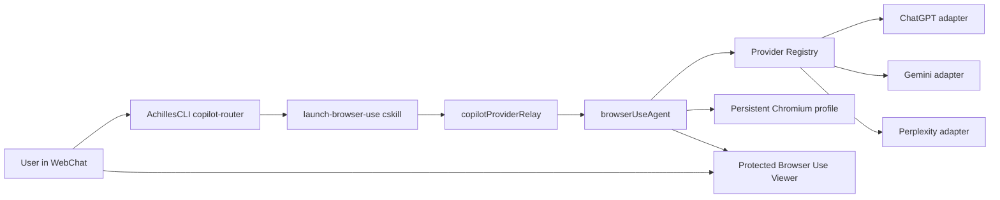
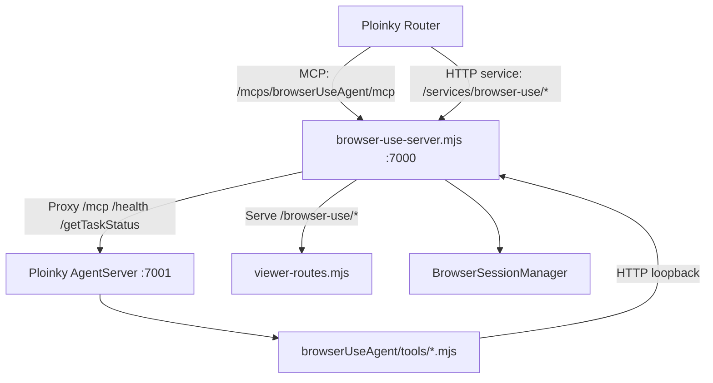
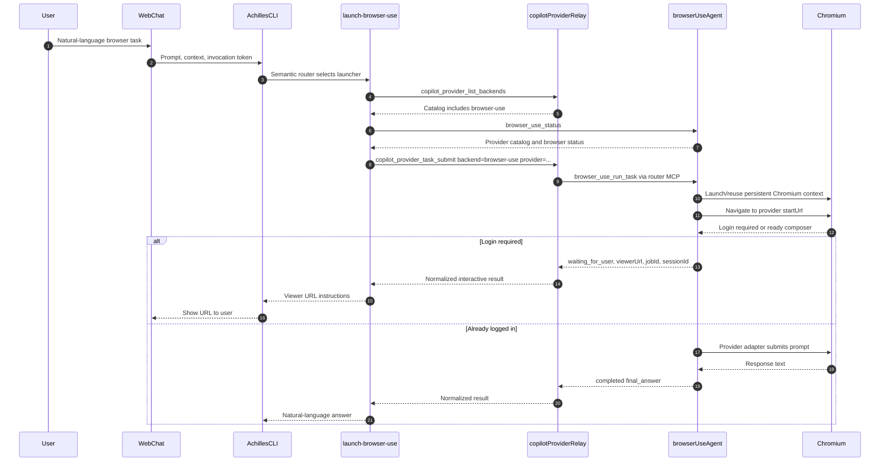
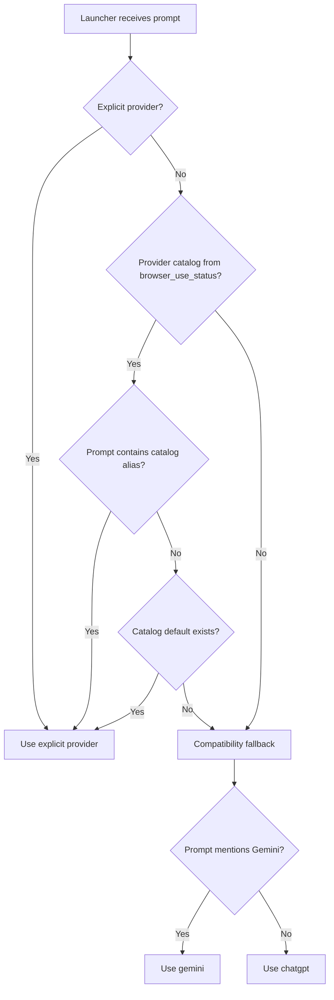
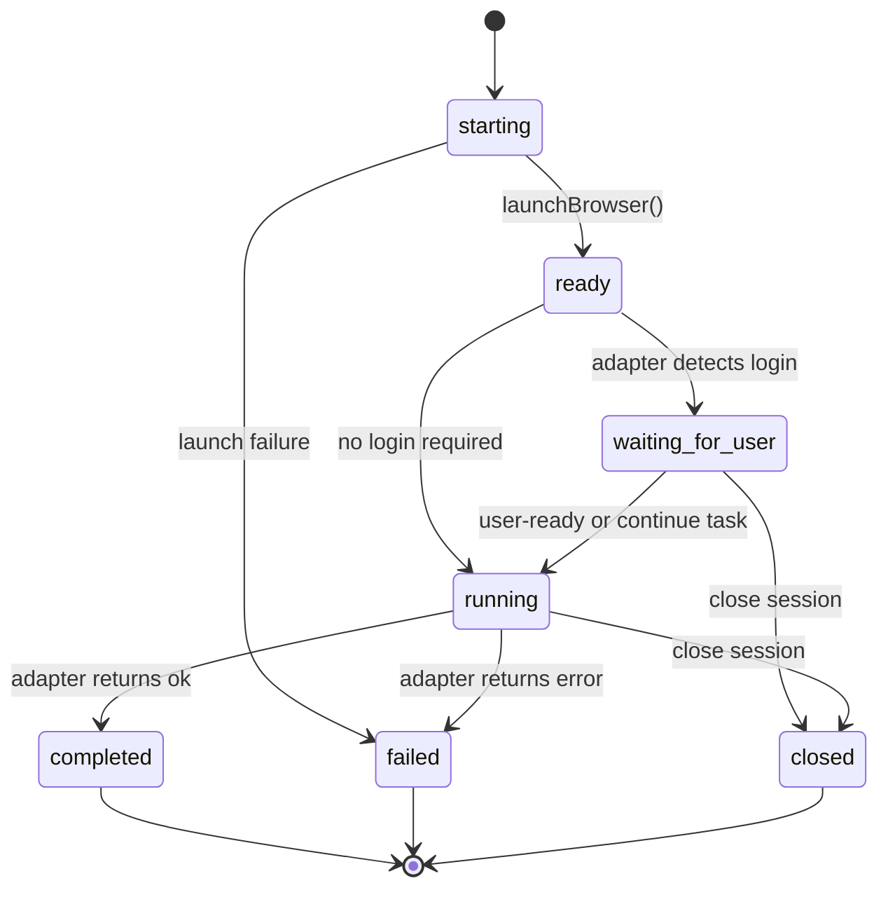
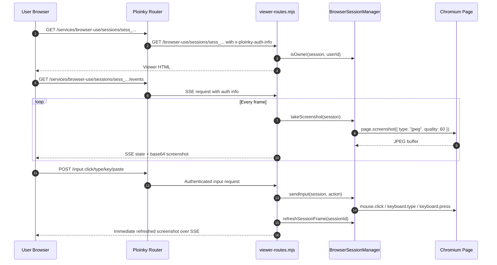
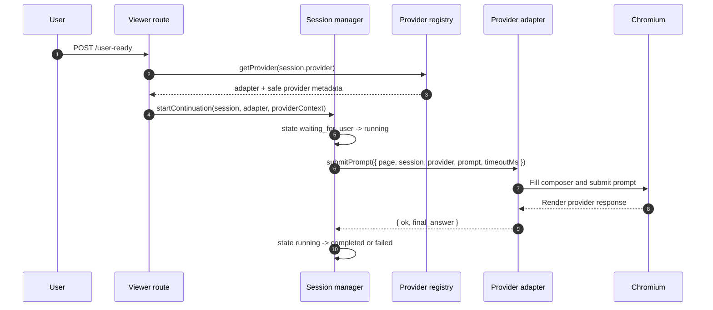
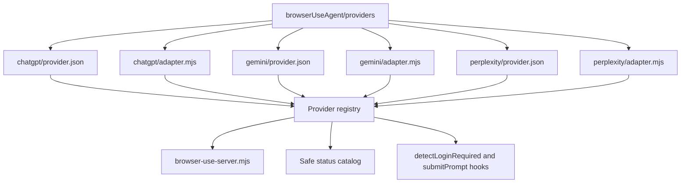

# Browser Use Agent Architecture

## Purpose

`browserUseAgent` is the interactive browser provider in the `copilot-agents`
repository. It lets AchillesCLI semantic Copilot tasks use logged-in browser
applications such as ChatGPT, Gemini, and Perplexity while keeping provider
selection, browser lifecycle, login handoff, and viewer authorization inside one
agent-owned boundary.

The agent is intentionally not a general chat agent and not a Ploinky framework
feature. It is a provider backend reached through:

1. AchillesCLI semantic routing.
2. The deterministic `launch-browser-use` cskill.
3. `copilotProviderRelay.copilot_provider_task_submit`.
4. `browserUseAgent.browser_use_run_task`.
5. An agent-owned Chromium session and protected viewer.

The durable contract is specified in:

- `docs/specs/DS014-browser-use-agent.md`
- `docs/specs/DS012-semantic-copilot-routing.md`
- `docs/specs/DS005-copilot-provider-relay-agent.md`
- `docs/specs/DS002-ploinky-runtime-invariants.md`
- `docs/specs/DS011-security-observability.md`

## Source Map

| Area | Files |
| --- | --- |
| Ploinky manifest and runtime | `browserUseAgent/manifest.json`, `browserUseAgent/scripts/startAgent.sh`, `browserUseAgent/scripts/install.sh`, `browserUseAgent/scripts/check-service.mjs` |
| MCP tool declarations | `browserUseAgent/mcp-config.json` |
| MCP tool shims | `browserUseAgent/tools/*.mjs`, `browserUseAgent/tools/lib/*.mjs` |
| Front HTTP service | `browserUseAgent/server/browser-use-server.mjs` |
| Browser/session lifecycle | `browserUseAgent/server/browser-session-manager.mjs` |
| Protected viewer | `browserUseAgent/server/viewer-routes.mjs` |
| Provider registry | `browserUseAgent/server/provider-registry.mjs` |
| Provider adapters | `browserUseAgent/providers/*/provider.json`, `browserUseAgent/providers/*/adapter.mjs` |
| Relay backend catalog | `copilotProviderRelay/tools/lib/backends.mjs`, `copilotProviderRelay/tools/lib/task.mjs` |
| Relay submit path | `copilotProviderRelay/tools/submit-task.mjs`, `copilotProviderRelay/tools/lib/mcp.mjs` |
| Achilles launcher | `achilles-skills/launch-browser-use/src/index.mjs`, `achilles-skills/launch-browser-use/cskill.md` |
| Bundle enablement | `research-agents/manifest.json` |
| Unit coverage | `tests/unit/browser-use-provider.test.mjs`, `tests/unit/launcher-browser-use.test.mjs`, `tests/unit/provider-task.test.mjs` |

## Libraries And Runtime Dependencies

| Dependency | Used By | Purpose |
| --- | --- | --- |
| Node.js `24.15.0-bookworm` container | `browserUseAgent/manifest.json` | Runtime image for the agent service and MCP tools. |
| Ploinky AgentServer | `browserUseAgent/scripts/startAgent.sh` | Hosts MCP tools on the internal MCP port. |
| Node `http` | `browser-use-server.mjs`, relay MCP client | HTTP front server, MCP proxying, and router-mediated MCP calls. |
| Node `fs`, `path`, `os` | session manager, registry, relay task normalization | Profile directories, stale Chromium lock cleanup, provider discovery, workspace path checks. |
| Node `crypto.randomUUID` | `BrowserSessionManager` | Session and job id generation. |
| Node `url` | viewer and provider registry | Request path parsing and local file adapter imports. |
| Node `buffer` | tool envelopes, relay MCP client | stdin envelope parsing and content-length calculation. |
| `playwright-core@1.52.0` | `BrowserSessionManager` | Controls Chromium persistent contexts, pages, keyboard, mouse, screenshots, and provider automation. |
| Chromium | installed by `browserUseAgent/scripts/install.sh` | Browser engine for provider web applications. |
| `fetch` / `AbortController` | MCP tools and launcher | Calls local service endpoints and router-mediated MCP endpoints with timeouts. |
| Server-Sent Events | `viewer-routes.mjs` | Streams viewer state and screenshots over the protected HTTP service. |
| Browser DOM APIs | generated viewer HTML | Captures clicks, keyboard, paste, and ready/close actions from the user's viewer page. |
| Achilles cskill runtime | `launch-browser-use` | Deterministic semantic launcher called by AchillesCLI Copilot. |
| Ploinky router secure-wire | relay and launcher calls | Routes MCP calls with `x-ploinky-caller-jwt` and protects HTTP viewer routes. |

## Repository Boundary

`browserUseAgent` owns browser providers as subproviders. The relay has one
backend id, `browser-use`, and forwards an optional `provider` string. It does
not have separate relay backends for ChatGPT, Gemini, or Perplexity.



This keeps Ploinky core and WebChat agent-agnostic. WebChat forwards prompt and
safe context; provider routing belongs to AchillesCLI launchers, the relay, and
provider agents.

## Deployment Architecture

`research-agents/manifest.json` enables `browserUseAgent global no-wait`
alongside `copilotProviderRelay`, `openInterpreterAgent`, and `webSearchAgent`.
The browser agent itself declares:

- `container: "node:24.15.0-bookworm"`
- `lite-sandbox: true`
- `agent: "sh /code/scripts/startAgent.sh"`
- protected HTTP service:
  - external prefix: `/services/browser-use/`
  - internal prefix: `/browser-use/`
  - auth: `protected`
- persistent volume:
  - host: `.ploinky/data/browserUseAgent`
  - container: `/data`

The manifest exposes these environment knobs:

| Variable | Default / Source | Purpose |
| --- | --- | --- |
| `BROWSER_USE_SERVICE_HOST` | `127.0.0.1` | Host used by MCP tool shims to reach the local front service. |
| `BROWSER_USE_BIND_HOST` | `0.0.0.0` in container profile | Bind host for the front service. |
| `BROWSER_USE_SERVICE_PORT` | `7000` | Public agent port and browser service port. |
| `BROWSER_USE_MCP_PORT` | `7001` | Internal AgentServer MCP port. |
| `BROWSER_USE_TIMEOUT_MS` | `120000` | Default provider task timeout for MCP tools. |
| `BROWSER_EXECUTABLE_PATH` | detected at startup | Chromium executable path. |
| `BROWSER_HEADLESS_MODE` | `new` | Browser launch mode interpreted by `BrowserSessionManager`. |

`startAgent.sh` starts two cooperating processes:

1. Ploinky AgentServer on `BROWSER_USE_MCP_PORT`.
2. `browser-use-server.mjs` on `BROWSER_USE_SERVICE_PORT`.

The front service proxies `/mcp`, `/health`, and `/getTaskStatus` to the
internal AgentServer so Ploinky can use the normal agent port. It handles
`/browser-use/*` itself so the protected viewer and task HTTP endpoints are
served by the browser service.



## MCP Tool Surface

`browserUseAgent/mcp-config.json` declares five MCP tools:

| Tool | Role |
| --- | --- |
| `browser_use_status` | Returns readiness, browser configuration, active session count, viewer transport, and safe provider catalog metadata. |
| `browser_use_run_task` | Starts or reuses an interactive provider task. Returns `waiting_for_user` with a viewer URL when login is required. |
| `browser_use_task_status` | Returns task and session state by `jobId`. |
| `browser_use_continue_task` | Continues a task after login, using the saved prompt and provider adapter. |
| `browser_use_close_session` | Closes one session or clears a provider profile when explicitly requested. |

The MCP tool files are thin shims. They read the Ploinky MCP stdin envelope,
derive user identity and invocation metadata, then call the local HTTP service.
They do not own browser state directly.

### Identity Sources

`browserUseAgent/tools/lib/identity.mjs` accepts identity from:

- secure-wire invocation metadata: `metadata.invocation.usr.id` or `sub`
- protected HTTP service auth metadata: `metadata.authInfo.user.id`

Task execution tools require an invocation token. Viewer routes require the
router-provided `x-ploinky-auth-info` header and check that the authenticated
user owns the session.

## Semantic Launch Flow

The normal user path is WebChat -> AchillesCLI -> launcher -> relay -> provider
agent. Browser-looking `@browser-use` or `@browser` text is ordinary chat text,
not dispatch syntax.



## Provider Selection Flow

`launch-browser-use` selects the browser subprovider in this order:

1. Explicit `provider` input.
2. Alias match from `browser_use_status.providers`.
3. Provider marked `default` in the status catalog.
4. Hardcoded compatibility fallback: `gemini` when the prompt says Gemini,
   otherwise `chatgpt`.

The relay preserves the selected provider only for backend `browser-use`. Other
provider backends do not receive browser provider selection.



## Front Service Request Flow

`browser-use-server.mjs` owns the live service process. It creates a singleton
`BrowserSessionManager`, loads the provider registry at startup, mounts viewer
routes, and exposes local HTTP endpoints used by MCP tool shims and protected
viewer pages.

| Endpoint | Caller | Purpose |
| --- | --- | --- |
| `GET /status` | status MCP shim and launcher availability probe | Read service readiness, session counts, viewer transport, and provider catalog. |
| `POST /browser-use/run-task` | `browser_use_run_task` shim | Resolve provider, create/reuse browser session, detect login, or submit prompt. |
| `GET /browser-use/task-status?jobId=...` | `browser_use_task_status` shim | Return owner-checked public session state. |
| `POST /browser-use/continue-task` | `browser_use_continue_task` shim | Continue a saved waiting/running task by job id. |
| `POST /browser-use/close-session` | `browser_use_close_session` shim | Close a session or clear a provider profile. |
| `GET /browser-use/sessions/:id` | protected viewer | Serve viewer HTML. |
| `GET /browser-use/sessions/:id/events` | protected viewer | Stream state and screenshots over SSE. |
| `POST /browser-use/sessions/:id/input` | protected viewer | Send click, text, key, or scroll to Chromium. |
| `POST /browser-use/sessions/:id/user-ready` | protected viewer | Start continuation after login. |
| `POST /browser-use/sessions/:id/close` | protected viewer | Close this viewer session. |

## Session Lifecycle

`BrowserSessionManager` tracks sessions in memory and stores durable browser
profile data under `/data/profiles/<safeUserId>/<provider>`.

Key responsibilities:

- generate `sess_*` and `job_*` ids
- normalize task timeouts between 1s and 300s
- serialize create/reuse with `withProfileLock(userId, provider, operation)`
- reuse active sessions for the same user/provider
- wait for pending Chromium context close before relaunching a profile
- clean stale Chromium `Singleton*` locks when the owning process is gone
- launch Playwright persistent Chromium contexts
- navigate to provider `startUrl`
- delegate login detection and prompt submission to adapters
- capture JPEG screenshots for the viewer
- serialize viewer input actions per session
- close browser resources on `completed`, `failed`, or `closed`
- expire sessions after 30 minutes



## Browser Launch Details

The current launch path uses `playwright-core` and Chromium persistent context:

- profile directory: `/data/profiles/<safeUserId>/<provider>`
- viewport: `1280x800`
- headless: `BROWSER_HEADLESS_MODE === "new"`
- launch args:
  - `--disable-dev-shm-usage`
  - `--disable-setuid-sandbox`
  - `--no-sandbox`
  - `--no-first-run`
  - `--disable-background-networking`
  - `--disable-default-apps`
  - `--disable-sync`
  - `--no-default-browser-check`
- default Playwright automation arg ignored:
  - `--enable-automation`

The browser is a Playwright-controlled Chromium instance. Some identity
providers can still reject this class of browser, especially first-time login in
headless mode. That failure is provider policy, not a viewer authorization
failure.

## Protected Viewer Architecture

The viewer is served as HTML from `viewer-routes.mjs` through the protected
Ploinky HTTP service. It is not a VNC or WebSocket stream. It uses:

- Server-Sent Events for state and screenshots.
- HTTP `POST` for user input.
- Playwright screenshots for visual feedback.
- Playwright mouse and keyboard APIs for interaction.

The viewer validates owner identity on every route:

1. Parse `x-ploinky-auth-info`.
2. Extract `user.id`, `user.sub`, `userId`, or `sub`.
3. Compare the safe user id with the session owner.
4. Return `401` when identity is missing and `403` when the owner does not
   match.



### Viewer Input Behavior

The viewer supports:

- click coordinate mapping from displayed image size to natural screenshot size
- printable keyboard text
- `Enter`, `Backspace`, `Delete`, `Tab`, `Escape`, arrows, `Home`, `End`,
  `PageUp`, and `PageDown`
- paste events
- a bottom text input fallback that sends text on Enter
- `Login Complete - Continue` button
- `Close Session` button

Typing is optimized for the screenshot transport:

- client-side input is chained so actions are sent in order
- printable text batches for 35ms to reduce HTTP fan-out
- server-side input is serialized by `session.inputPromise`
- successful input triggers `refreshSessionFrame(sessionId)`
- the periodic screenshot loop runs every 500ms
- screenshot refreshes are queued per session to avoid overlapping captures

This makes the screenshot viewer more responsive, but it still cannot feel as
instant as a native remote desktop stream.

## Login And Continuation Flow

When a provider adapter reports login is required, `runTask` returns an
interactive payload:

```json
{
  "ok": true,
  "state": "waiting_for_user",
  "requires_user_action": true,
  "session_reused": false,
  "jobId": "job_...",
  "sessionId": "sess_...",
  "viewerUrl": "/services/browser-use/sessions/sess_...",
  "final_answer": "",
  "natural_language_output": "",
  "resources": [],
  "sources": []
}
```

The launcher converts `viewerUrl` into a full browser URL using WebChat origin
metadata when available, or a localhost router fallback for local workspaces.

After the user completes login:

1. User clicks `Login Complete - Continue`.
2. Viewer posts to `/browser-use/sessions/:id/user-ready`.
3. `viewer-routes.mjs` looks up the provider adapter from the registry.
4. `BrowserSessionManager.startContinuation()` moves state to `running`.
5. The saved prompt is submitted through the adapter in the same Chromium
   context.
6. Result becomes `completed` or `failed`.



## Provider Registry

`provider-registry.mjs` discovers provider folders at startup. In a container it
looks under `/code/providers`; locally it resolves relative to the server
module.

Each enabled provider folder must contain:

- `provider.json`
- `adapter.mjs`

`provider.json` must define:

| Field | Meaning |
| --- | --- |
| `id` | Safe provider id matching `/^[A-Za-z0-9._-]{1,64}$/`. |
| `label` | Human-readable provider name. |
| `aliases` | Lowercase prompt/provider aliases used by launcher and registry resolution. |
| `startUrl` | HTTP or HTTPS URL for initial navigation. |
| `default` | Whether this provider is the default candidate. |
| `enabled` | `false` disables discovery. Missing or true enables it. |
| `order` | Catalog sort order and default tie-breaker. |

`adapter.mjs` must export:

```js
export async function detectLoginRequired({ page, session, provider }) {}
export async function submitPrompt({ page, session, provider, prompt, timeoutMs }) {}
```

The registry:

- validates provider ids, labels, start URLs, and aliases
- rejects duplicate provider ids
- rejects duplicate aliases across providers
- dynamically imports adapters
- validates adapter exports
- sorts safe catalog metadata by `order`
- exposes adapters only inside the service process
- returns only safe metadata from `listProviders()`



## Current Provider Adapters

| Provider | Start URL | Login detection | Prompt submission |
| --- | --- | --- | --- |
| ChatGPT | `https://chatgpt.com/` | Login buttons, Auth0, OpenAI login URLs. | Finds composer, fills prompt, clicks send, waits for assistant message stability, extracts last assistant response. |
| Gemini | `https://gemini.google.com/app` | Sign-in links/buttons and Google account URLs. | Finds rich textarea/contenteditable composer, types prompt, presses Enter, waits for response selectors to stabilize. |
| Perplexity | `https://www.perplexity.ai/` | Sign-in/log-in buttons and auth URLs. | Finds textarea/contenteditable composer, submits via button or Enter, waits for prose/answer/response selectors. Adapter explicitly reports selector drift when extraction is empty. |

Provider adapters are intentionally selector-based and therefore expected to
drift as external web UIs change. The provider registry isolates that churn from
the session manager and relay.

## Relay Integration

The relay catalog entry for `browser-use` is:

```js
{
  id: "browser-use",
  label: "Browser Use",
  default_profile: "default",
  provider: { agent: "browserUseAgent", tool: "browser_use_run_task" },
  cacheable: false,
  interactive: true
}
```

`copilotProviderRelay` responsibilities:

- validate backend id
- bound prompt length
- materialize bounded inline/path resources
- forward provider task to `browserUseAgent` over router-mediated MCP
- forward `x-ploinky-caller-jwt`
- normalize provider payloads
- preserve interactive metadata:
  - `state`
  - `sessionId`
  - `viewerUrl`
  - `requires_user_action`
  - `session_reused`
  - `interactive`

It does not own browser profiles, provider adapters, selectors, or Chromium.

## Security Model

Security is split by entry point:

### MCP tools

- Execution tools require a router invocation token in MCP metadata.
- The relay forwards that token as `x-ploinky-caller-jwt`.
- `browserUseAgent` derives the user id from invocation metadata.
- Tool shims call the local HTTP service with that user id.

### Protected viewer

- The viewer is reachable only through manifest-declared protected HTTP service
  routing.
- Ploinky router injects authoritative `x-ploinky-auth-info`.
- Viewer routes check session ownership before serving HTML, SSE, status,
  input, user-ready, or close.
- The viewer URL is safe to return as router-relative internal metadata, but
  user-facing launcher text renders a full URL.

### Sensitive data controls

The default implementation must not log:

- credentials
- cookies
- localStorage or sessionStorage
- OAuth callback URLs
- authorization codes
- screenshots
- DOM dumps
- raw auth headers
- invocation tokens

Screenshots are streamed transiently over SSE to the authenticated session owner
and are not written to tracked source or default logs.

## Data And State

| State | Location | Durability |
| --- | --- | --- |
| Browser session map | `BrowserSessionManager._sessions` | In-memory; lost on service restart. |
| Per-profile operation locks | `BrowserSessionManager._profileOperations` | In-memory. |
| Browser profile data | `/data/profiles/<safeUserId>/<provider>` | Persistent through `.ploinky/data/browserUseAgent`. |
| Last screenshot buffer | `session.screenshot` | In-memory. |
| Viewer SSE clients | `viewer-routes.mjs` local map | In-memory. |
| Provider catalog | Registry loaded at service startup | In-memory, from source files. |
| Task prompt for continuation | `session.prompt` | In-memory per session. |

Because sessions are in-memory, a service restart invalidates active viewer
session ids even though browser profile data remains on disk.

## Error And Edge Behavior

| Case | Behavior |
| --- | --- |
| No provider registry entries load | Service startup fails fast. |
| Unsupported provider string | `runTask` returns `unsupported provider`. |
| Browser launch failure | Session moves to `failed`, returns a user-facing start failure message. |
| Login required | Session moves to `waiting_for_user`; launcher returns viewer URL. |
| Same user/provider already active | Existing session is reused and latest prompt/timeout is stored unless it is already running. |
| Viewer missing auth | `401 authenticated user identity is required`. |
| Viewer wrong owner | `403 not session owner`. |
| Provider selector drift | Adapter returns an error or empty extraction message; Perplexity has explicit proof-adapter drift messaging. |
| IdP blocks automated browser | Provider page may reject login; the agent cannot guarantee first-time login for every web identity provider. |

## Extension Guide: Add A Provider

To add a browser provider without changing session manager, relay, or launcher
code:

1. Create `browserUseAgent/providers/<providerId>/provider.json`.
2. Set a safe `id`, `label`, `aliases`, `startUrl`, `enabled`, `default`, and
   `order`.
3. Create `browserUseAgent/providers/<providerId>/adapter.mjs`.
4. Export `detectLoginRequired({ page, session, provider })`.
5. Export `submitPrompt({ page, session, provider, prompt, timeoutMs })`.
6. Keep provider-specific selectors in the adapter only.
7. Return `{ ok: true, final_answer }` on success.
8. Return `{ ok: false, final_answer: "", error }` on failure.
9. Add unit tests for registry discovery and adapter integration if the change
   introduces new behavior.
10. Run `node scripts/validate-manifests.mjs` and relevant unit tests.

The open/closed principle is the point of the registry: new provider folders are
new extensions; existing session, viewer, relay, and launcher code should remain
stable unless the provider contract itself changes.

## Verification

Current relevant checks:

- `node --test tests/unit/browser-use-provider.test.mjs`
- `node --test tests/unit/launcher-browser-use.test.mjs`
- `node --test tests/unit/provider-task.test.mjs`
- `node --test tests/unit/*.test.mjs`
- `node scripts/validate-manifests.mjs`
- `git diff --check`

Important behavior covered by tests:

- `browser-use` exists in the relay catalog and is interactive.
- Relay preserves interactive browser metadata.
- Browser-use manifest declares protected HTTP service and persistent volume.
- Browser-use MCP config exposes the expected five tools.
- `research-agents` bundle enables `browserUseAgent`.
- Identity can come from secure-wire invocation metadata or protected auth info.
- Front service proxies MCP on the public agent port.
- Viewer forwards keyboard/click/paste input and triggers responsive refresh.
- Session manager reuses active same-owner/same-provider sessions.
- Session manager serializes profile operations and viewer input.
- Provider registry discovers, validates, aliases, disables, and rejects invalid
  providers.
- Launcher rejects missing invocation tokens and deprecated visible tokens.
- Launcher resolves providers through explicit input, catalog aliases, catalog
  default, and compatibility fallback.
- Launcher returns full viewer URLs for waiting sessions.

## Known Limitations

- The viewer is HTTP/SSE screenshot transport, not noVNC, WebRTC, or WebSocket
  remote desktop. It is portable through the current Ploinky HTTP service proxy
  but has inherent screenshot latency.
- Some identity providers reject Playwright-controlled Chromium, especially
  headless first-time login flows.
- Provider adapters depend on external web UI selectors and can drift.
- Active session ids are not durable across service restarts.
- The browser profile can persist login state, but only within the
  per-user/per-provider profile directory.
- Direct localhost container ports are operational details; user-facing access
  should go through the Ploinky router protected service URL.

## Operational Checklist

When debugging browser-use locally:

1. Confirm the bundle enables `browserUseAgent`.
2. Check `browser_use_status` or `GET /status` for provider catalog and
   `chromiumAvailable`.
3. Confirm the viewer URL goes through `/services/browser-use/sessions/:id`.
4. Confirm the viewer request has router-injected auth metadata.
5. Use the session `jobId` with `browser_use_task_status` when investigating
   state.
6. Close stale sessions before retrying the same provider profile.
7. Clear a profile only on explicit user request because it deletes login state.
8. Treat screenshots, credentials, cookies, and callback URLs as sensitive.
